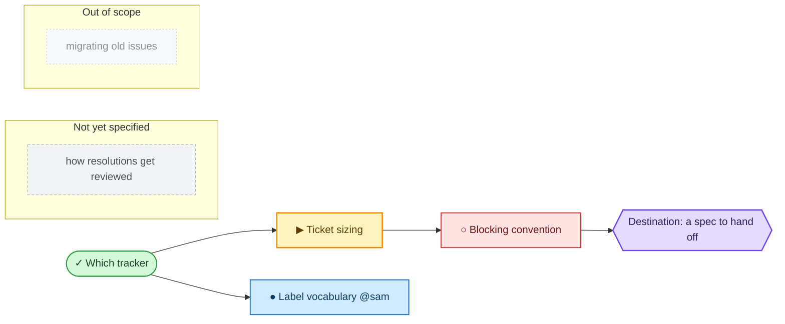

A loose idea has arrived, too big for one agent session, and wrapped in fog: the way from here to the **destination** isn't visible yet. Wayfinding is about finding that way, not charging at the destination. This skill charts the way as a **shared map** in the Obsidian vault, then works its **decision tickets** (questions whose resolution is a decision, not slices of a build to execute) one at a time until the route is clear.

The destination varies per effort, and naming it is the first act of charting: it shapes every ticket. It might be a spec to hand off and iterate on, a decision to lock before planning starts, or a change made in place like a data-structure migration. The map is domain-agnostic: engineering work, course content, whatever fits the shape.

## Plan, don't do

Wayfinder is **planning** by default: each ticket resolves a decision, and the map is done when the way is clear, with nothing left to decide before someone goes and does the thing. The pull to just do the work is usually the signal you've reached the edge of the map and it's time to hand off. An effort can override this in its **Notes**, carrying execution into the map itself, but absent that, produce decisions, not deliverables.

## Refer by name

Every map and ticket is an issue, so it has a **name**: its title. In everything the human reads (narration, the map's Decisions-so-far), refer to it by that name, never by a bare id, number, or slug. A wall of `#42, #43, #44` is illegible; names read at a glance. The id and URL don't vanish; a name wraps its link, but they ride _inside_ the name, never stand in for it.

## The Map

The map is a single note in the Obsidian vault at `~/obsidian`, the canonical artifact. Its tickets are child notes of the map.

The map is an **index**, not a store. It lists the decisions made and points at the tickets that hold their detail; a decision lives in exactly one place, its ticket, so the map never restates it, only gists it and links.

**Every map lives in the Obsidian vault at `~/obsidian`, whatever repo the session is running in.** Planning is one system across all of this dev's work, so wayfinding ignores the current repo's issue tracker; that tracker still owns implementation tickets, and the map links out to it when a decision lands there.

### Where it lives

One directory per effort, inside the project it belongs to:

```
~/obsidian/06-Spaces/03-Projects/<Project>/<Effort>/
├── map.md
└── issues/
    ├── 01-<slug>.md
    └── 02-<slug>.md
```

**Which project.** Every effort belongs to exactly one project directory under `06-Spaces/03-Projects/`. Resolve it before writing anything: match the effort against the existing directories and create the effort directory inside the one that matches. **With no match, ask the user whether to create a new project**, proposing a name in the style of its siblings, and wait for the answer; the user owns their vault's top-level shape.

State lives in **YAML frontmatter**, so Dataview and Bases can query it. The map:

```yaml
---
type: map
status: active        # active | done
---
```

A ticket, numbered from `01`:

```yaml
---
type: grilling        # research | prototype | grilling | task
status: open          # open | claimed | resolved
blocked-by: ["[[02-ticket-sizing]]"]
map: "[[map]]"
---
```

`blocked-by` holds wikilinks, so Obsidian's graph view draws the dependency edges and renames stay correct. A ticket is unblocked when every ticket it lists is `resolved`.

**Frontier scan**: the notes under `<Effort>/issues/` that are `open`, unblocked, and unclaimed; first by number wins. The map's `## Frontier` block shows the human the same set without opening a ticket.

### The map body

The whole map at low resolution, loaded once per session. Open tickets are **not** listed: they are open child issues, found by query.

````markdown
## Destination

<what reaching the end of this map looks like: the spec, decision, or change this effort is finding its way to. One or two lines; every session orients to it before choosing a ticket.>

## Notes

<domain; skills every session should consult; standing preferences for this effort>

## Decisions so far

<!-- the index: one line per closed ticket, enough to judge relevance, then zoom the link for the detail the ticket holds -->

- [<closed ticket title>](link): <one-line gist of the answer>

## Not yet specified

<!-- see "Fog of war": in-scope fog you can't ticket yet; graduates as the frontier advances -->

## Out of scope

<!-- see "Out of scope": work ruled beyond the destination; closed, never graduates -->

## Minimap

<!-- see "The minimap": regenerated from the tracker, never hand-edited -->

<!-- minimap:begin -->
<!-- minimap:end -->

## Frontier

```dataview
LIST
FROM "06-Spaces/03-Projects/<Project>/<Effort>/issues"
WHERE status = "open"
SORT file.name ASC
```
````

### Tickets

Each ticket is a **child issue** of the map; the tracker's issue id is its identity. Its body is the question, sized to one 100K token agent session:

```markdown
## Question

<the decision or investigation this ticket resolves>
```

Each ticket records its type, one of `research`, `prototype`, `grilling`, `task` (see [Ticket Types](#ticket-types)), the way the tracker doc says.

A session **claims** a ticket by setting `status: claimed` and saving, **first**, before any work, so concurrent sessions skip it. That mark _is_ the claim: an `open` ticket is takeable.

Blocking uses the tracker's **native** dependency relationship: essential because it renders the frontier _visually_ in the tracker's own UI, so the human sees what's takeable without opening the map. Only a tracker that lacks native blocking falls back to a body convention. A ticket is **unblocked** when every ticket blocking it is closed; the **frontier** is the open, unblocked, unclaimed children, the edge of the known.

The answer isn't part of the body; it's recorded on resolution (see [Work through the map](#work-through-the-map)). Assets created while resolving a ticket are linked from the issue, not pasted in.

## Ticket Types

Every ticket is either **HITL** (human in the loop, worked _with_ a human who speaks for themselves) or **AFK**, driven by the agent alone. A HITL ticket only resolves through that live exchange; the agent never stands in for the human's side of it (a grilling agent that answers its own questions has broken this).

- **Research** (AFK): Reading documentation, third-party APIs, or local resources like knowledge bases to surface a fact a decision waits on. Resolved by a subagent that calls the Skill tool with "research". Use when knowledge outside the current working directory is required.
- **Prototype** (HITL): Raise the fidelity of the discussion by making a cheap, rough, concrete artifact to react to (an outline, a rough take, a stub, or UI/logic code) by calling the Skill tool with "prototype". Links the prototype as an asset. Use when "how should it look" or "how should it behave" is the key question.
- **Grilling** (HITL): Conversation. The default case. Always call the Skill tool twice, for "grilling" and "domain-modeling".
- **Task** (HITL or AFK): Manual work that must happen before a _decision_ can be made: nothing to decide, prototype, or research, but the discussion is blocked until it's done. Signing up for a service so its API can be judged, provisioning access, moving data so its shape can be seen. This is the one type that _does_ rather than decides, and it earns its place by unblocking a decision, not by delivering the destination. The agent drives it alone where it can (AFK); otherwise it hands the human a precise checklist (HITL). Resolved when the work is done; the answer records what was done and any resulting facts (credentials location, new URLs, row counts) later tickets depend on.

## Fog of war

The map is _deliberately_ incomplete: don't chart what you can't yet see. Beyond the live tickets lies the **fog of war**: the dim view of decisions and investigations you can tell are coming but can't yet pin down, because they hang on questions still open. Resolving a ticket clears the fog ahead of it, graduating whatever's now specifiable into fresh tickets, one at a time, until the way to the destination is clear and no tickets remain.

The map's **Not yet specified** section is where that dim view is written down: the suspected question, the area to revisit later. It's the undiscovered frontier _toward_ the destination: everything here is in scope, just not sharp enough to ticket. Write as loosely or as fully as the view allows; it doubles as a signpost for collaborators reading where the effort is headed.

**Fog or ticket?** The test is whether you can state the question precisely now, _not_ whether you can answer it now.

- **Ticket when** the question is already sharp, even if it's blocked and you can't act on it yet.
- **Not yet specified when** you can't yet phrase it that sharply. Don't pre-slice the fog into ticket-sized pieces: it's coarser than a ticket, and one patch may graduate into several tickets, or none, once the frontier reaches it.

**Not yet specified** excludes what's already decided (Decisions so far), what's already a live ticket, and what's out of scope (the next section).

## Out of scope

Fog only ever gathers _toward_ the destination. The destination fixes the scope, so work beyond it is **out of scope**: it isn't fog, and it doesn't belong in **Not yet specified**. It gets its own **Out of scope** section on the map: work you've consciously ruled out of _this_ effort. Scope, not sharpness, lands it here.

Out-of-scope work never graduates (the frontier stops at the destination), so it returns only if the destination is redrawn, and then as a fresh effort, not a resumption.

Ruling something out of scope is a scoping act, not a step on the route. When a ticket that already exists turns out to sit past the destination (mis-scoped in while charting, or exposed by a resolution), **close it** (a closed ticket is unambiguously off the frontier) and leave one line in the **Out of scope** section: the gist plus why it's out of scope, linking the closed ticket. It stays out of **Decisions so far**, which records the route actually walked; a scope boundary isn't a step on it.

## The minimap

The tracker renders blocking edges, but not the destination, the fog, or what's been ruled out. The **minimap** is the whole effort in one picture: a Mermaid `flowchart` between the map body's `minimap` markers, regenerated from the tracker. It is a view, not a store, so the tracker stays authoritative and the frontier query still decides which ticket a session takes.

One node per ticket and per fog patch, titled by **name** (see [Refer by name](#refer-by-name)) and prefixed to encode state. State is carried **twice**, by prefix and by colour: the prefix so the picture still reads where colour is dropped (plain-text diffs, monochrome print, colour-blind readers), the colour so the shape of the effort reads at a glance without parsing labels.

| Prefix | State | Class | Colour |
| --- | --- | --- | --- |
| `✓` | decided: closed ticket | `decided` | green |
| `▶` | frontier: open, unblocked, unclaimed | `frontier` | amber |
| `●` | claimed, followed by `@dev` | `claimed` | blue |
| `○` | blocked | `blocked` | red |
| — | the destination | `dest` | violet |
| — | fog patch | `fog` | grey, dashed |
| — | out of scope | `oos` | faint grey, dashed |

The destination is a hexagon (`{{ }}`); fog patches and out-of-scope lines sit in their own labelled subgraphs. Edges run blocker → blocked. Every node is a gist: the detail stays in the tickets, and the answers stay in Decisions-so-far.

The `classDef` block is part of the generated minimap: emit it verbatim every regeneration, then assign every node a class with `class <ids> <name>`. Fills are light with explicit dark text, so the diagram stays legible under both light and dark Obsidian themes rather than inheriting whichever one rendered it.



## Invocation

Two modes. Either way, **never resolve more than one ticket per session**, with the exception of research tickets.

### Chart the map

User invokes with a loose idea.

1. **Name the destination.** Call the Skill tool twice, for "grilling" and "domain-modeling", to pin down what this map is finding its way to: the spec, decision, or change. The destination fixes the scope, so it's settled first.
2. **Map the frontier.** Grill again, **breadth-first** this time: fan out across the whole space rather than deep on any one thread, surfacing the open decisions and the first steps takeable now. **If this surfaces no fog** (the way to the destination is already clear, the whole journey small enough for one session), you don't need a map. Stop and ask the user how they'd like to proceed.
3. **Create the map** (label `wayfinder:map`): Destination and Notes filled in, Decisions-so-far empty, the fog sketched into **Not yet specified**.
4. **Create the tickets you can specify now** as child issues of the map, then wire blocking edges in a **second pass** (issues need ids before they can reference each other). Wiring sorts them into the frontier and the blocked; everything you can't yet specify stays in the fog: the **Not yet specified** section.
5. **Regenerate the minimap** so the human sees the shape charted: the destination, the route, the frontier, and the fog.
6. **Fire the research subagents.** For each `research` ticket you just created, spin up a subagent that calls the Skill tool with "research" to resolve it in parallel, capturing its findings on a throwaway `research/<name>` branch with a context pointer from the ticket.
7. Stop: charting is one session's work; it hand-resolves nothing.

### Work through the map

User invokes with a map (URL or number). A ticket is **optional**: without one, you pick the next decision, not the user.

1. Load the **map**: the low-res view, not every ticket body.
2. Choose the ticket. If the user named one, use it. Otherwise take the first frontier ticket in order. **Claim it**: assign it to yourself before any work.
3. Resolve it. **Zoom as needed**: fetch the full body of any related or closed ticket on demand; call the Skill tool for whichever skills the `## Notes` block names. If in doubt, call the Skill tool twice, for "grilling" and "domain-modeling".
4. Record the resolution: append the answer under an `## Answer` heading, set `status: resolved`, and **append a context pointer** to the map's Decisions-so-far.
5. Add newly-surfaced tickets (create-then-wire); graduate any fog the answer has made specifiable, clearing each graduated patch from **Not yet specified** so it lives only as its new ticket. If the answer reveals that a ticket (this one or another) sits beyond the destination, **rule it out of scope** rather than resolving it on the route. If the decision invalidates other parts of the map, update or delete those tickets.
6. **Regenerate the minimap** from the tracker's current state.

The user may run unblocked tickets in parallel, so expect other sessions to be editing the tracker concurrently.
