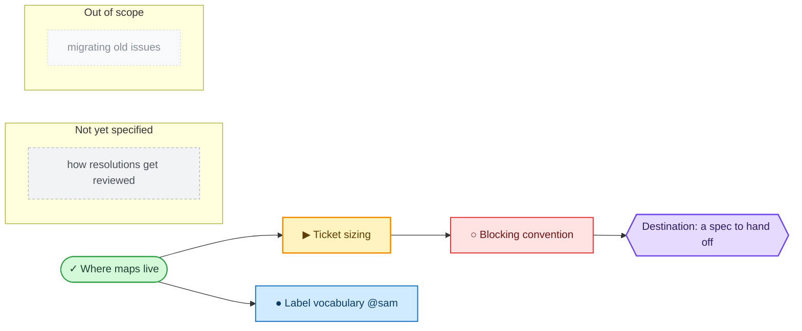

# Wayfinder minimap

The **minimap** is the whole effort in one picture: a Mermaid `flowchart` between the map body's `minimap` markers, regenerated from the map and its ticket notes. It is a view, not a store; note frontmatter remains authoritative and the frontier query decides which ticket a session takes.

Use one node per ticket and fog patch. Title ticket nodes with their human-readable note title, never a bare filename or number, and prefix each node to encode state. State is carried **twice**, by prefix and by colour: the prefix so the picture still reads where colour is dropped (plain-text diffs, monochrome print, colour-blind readers), the colour so the shape of the effort reads at a glance without parsing labels.

| Prefix | State | Class | Colour |
| --- | --- | --- | --- |
| `✓` | decided: resolved ticket | `decided` | green |
| `▶` | frontier: open, unblocked, unclaimed | `frontier` | amber |
| `●` | claimed, followed by `@dev` | `claimed` | blue |
| `○` | blocked | `blocked` | red |
| — | the destination | `dest` | violet |
| — | fog patch | `fog` | grey, dashed |
| — | out of scope | `oos` | faint grey, dashed |

The destination is a hexagon (`{{ }}`); fog patches and out-of-scope lines sit in their own labelled subgraphs. Edges run blocker → blocked. Every node is a gist: the detail stays in the tickets, and the answers stay in Decisions-so-far.

The `classDef` block is part of the generated minimap: emit it verbatim every regeneration, then assign every node a class with `class <ids> <name>`. Fills are light with explicit dark text, so the diagram stays legible under both light and dark Obsidian themes rather than inheriting whichever one rendered it.

